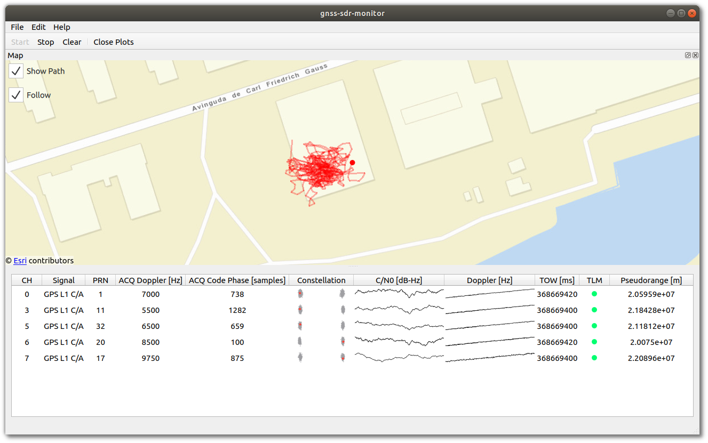
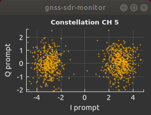
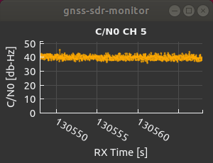
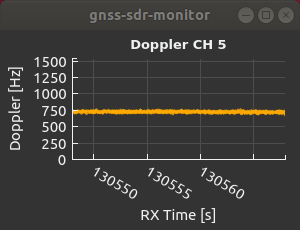

[](https://www.gnu.org/licenses/gpl-3.0)
[](https://gitlab.com/acebrianjuan/gnss-sdr-monitor/pipelines)
[](https://scan.coverity.com/projects/acebrianjuan-gnss-sdr-monitor)

**Welcome to gnss-sdr-monitor!**

This program is a graphical user interface developed with [Qt](https://www.qt.io/) for monitoring the status of [GNSS-SDR](https://gnss-sdr.org) in real time.



<table style="width:100%">
  <tr>
    <td></td>
    <td></td>
    <td></td>
  </tr>
</table>

## How to use gnss-sdr-monitor

This GUI is designed to receive real-time data from GNSS-SDR over the network either **locally** (GNSS-SDR and GUI instances running on the same machine) or **remotely** (GNSS-SDR and GUI instances running on different machines).


The data that is required by the GUI to work comes from GNSS-SDR via two serialization streams over UDP: the [**Monitor block streaming**](https://gnss-sdr.org/docs/sp-blocks/monitor/) and the [**PVT block streaming**](https://gnss-sdr.org/docs/sp-blocks/pvt/#custom-streaming), which are independent from each other and provide different kinds of information. In addition, the GUI provides a widget for communicating with the receiver interactive interface ([Telecommand via TCP/IP](https://gnss-sdr.org/docs/sp-blocks/global-parameters/#telecommand-via-tcpip)) by allowing you to send special commands to GNSS-SDR.


<sup>Figure: GNSS-SDR general block diagram from the documentation page: <a href="https://gnss-sdr.org/docs/sp-blocks/">https://gnss-sdr.org/docs/sp-blocks/</a>. The Monitor block streaming and PVT block streaming are highlighted in red. The Telecommand module is highlighted in green. </sup>

Therefore, if you want to use the GUI, it is essential that _at least_ you **activate both serialization data streams in your GNSS-SDR receiver configuration file** by following these instructions:

In your configuration file, append the following lines to the `#PVT CONFIG#` section. Put the IP address of the machine where the GUI is running and choose a port number at your own discretion. I am using the loopback address and port 1111 as an example.

```
PVT.enable_monitor=true
PVT.monitor_client_addresses=127.0.0.1
PVT.monitor_udp_port=1111
```

This will activate the **serialized stream of PVT data** to the GUI, which will let you see the position reported by the receiver on a live map as well as a charts of the reported altitude and dilution of precision.

Next, add the following chunk in the `#MONITOR CONFIG#` section. Again, choose the IP address of the machine where the GUI is running and a port number that work best for you.

```
Monitor.enable_monitor=true
Monitor.decimation_factor=1
Monitor.client_addresses=127.0.0.1
Monitor.udp_port=1112
```

This will activate the **serialized stream of data from the Monitor block** to the GUI, which will let you see a table-like widget with the status of each channel accompanied by data readings of the acquisition and tracking stages.

Making sure that the GUI setup matches that of the GNSS-SDR configuration file is a critical step for the connection to work. In the menu bar of the GUI go to `Edit > Preferences`, and verify that the port numbers are correct.

<p align="center">
  
</p>

Finally, if you want to make use of the **Telecommand** functionality (which is something I would recommend), append the following lines to the `#GLOBAL OPTIONS#` section of the configuration file.

```
GNSS-SDR.telecommand_enabled=true
GNSS-SDR.telecommand_tcp_port=3333
```

And then enter the IP address and TCP port number in the widget.

<p align="center">
  
</p>

This will let you send commands to control the GNSS-SDR instance that you are monitoring with the GUI.

Once you complete these steps you are all set.

## How to build gnss-sdr-monitor

### Install dependencies using software packages:

#### Debian / Ubuntu

If you are using Debian 10, Ubuntu 18.04 or above, this can be done by copying and pasting the following line in a terminal:

~~~~
$ sudo apt install build-essential cmake git libboost-dev libboost-system-dev \
       libprotobuf-dev protobuf-compiler qtbase5-dev qtdeclarative5-dev qtpositioning5-dev \
       libqt5charts5-dev qml-module-qtquick2 qml-module-qtquick-controls2 qml-module-qtquick-window2 \
       qml-module-qtlocation qml-module-qtpositioning qml-module-qtquick-layouts
~~~~

Once you have installed these packages, you can jump directly to [download the source code and build gnss-sdr-monitor](#download-and-build-linux).

#### Arch Linux

If you are using Arch Linux:

~~~~
$ pacman -S gcc make cmake git boost boost-libs protobuf qt5-base qt5-declarative qt5-location \
       qt5-charts qt5-quickcontrols2
~~~~

Once you have installed these packages, you can jump directly to [download the source code and build gnss-sdr-monitor](#download-and-build-linux).

#### CentOS

If you are using CentOS 7, you can install the dependencies via Extra Packages for Enterprise Linux ([EPEL](https://fedoraproject.org/wiki/EPEL)):

~~~~
$ sudo yum install wget
$ wget https://dl.fedoraproject.org/pub/epel/epel-release-latest-7.noarch.rpm
$ sudo rpm -Uvh epel-release-latest-7.noarch.rpm
$ sudo yum install gcc-c++ make cmake git boost-devel protobuf-devel protobuf-compiler \
       qt5-qtbase-devel qt5-qtdeclarative-devel qt5-qtlocation-devel qt5-qtcharts-devel \
       qt5-qtdeclarative-devel
~~~~

Once you have installed these packages, you can jump directly to [download the source code and build gnss-sdr-monitor](#download-and-build-linux).

#### Fedora

If you are using Fedora 28 or above, the required software dependencies can be installed by doing:

~~~~
$ sudo dnf install gcc-c++ make cmake git boost-devel protobuf-devel protobuf-compiler \
       qt5-qtbase-devel qt5-qtdeclarative-devel qt5-qtlocation-devel qt5-qtcharts-devel \
       qt5-qtdeclarative-devel
~~~~

Once you have installed these packages, you can jump directly to [download the source code and build gnss-sdr-monitor](#download-and-build-linux).

#### openSUSE

If you are using openSUSE Leap or openSUSE Tumbleweed:

~~~~
$ zypper install gcc-c++ cmake git boost-devel protobuf-devel libqt5-qtnetworkauth-devel \
       libQt5PrintSupport-devel libQt53DQuick-devel libqt5-qtlocation-devel libQt5Charts5-devel
~~~~

Once you have installed these packages, you can jump directly to [download the source code and build gnss-sdr-monitor](#download-and-build-linux).

### <a name="download-and-build-linux">Clone gnss-sdr-monitor Git repository</a>:

~~~~~~
$ git clone https://github.com/acebrianjuan/gnss-sdr-monitor
~~~~~~

### Build and install gnss-sdr-monitor:

~~~~~~
$ cd gnss-sdr-monitor/build
$ cmake ..
$ make
~~~~~~

This will create the `gnss-sdr-monitor` executable at the gnss-sdr-monitor/src directory. You can run it from that folder, but if you prefer to install `gnss-sdr-monitor` on your system and have it available anywhere else, do:

~~~~~~
$ sudo make install
~~~~~~

### Run gnss-sdr-monitor:

~~~~~~
$ cd src/
$ ./gnss-sdr-monitor
~~~~~~

